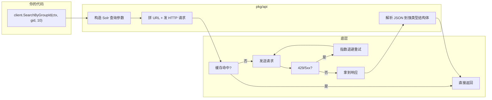
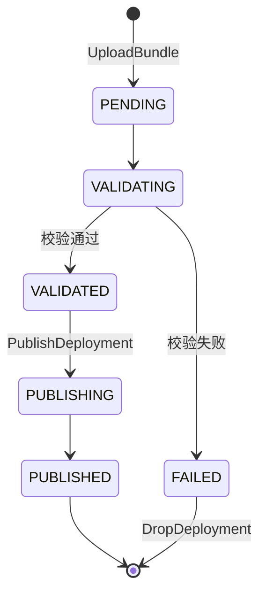
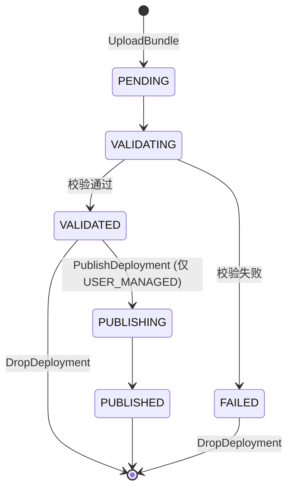
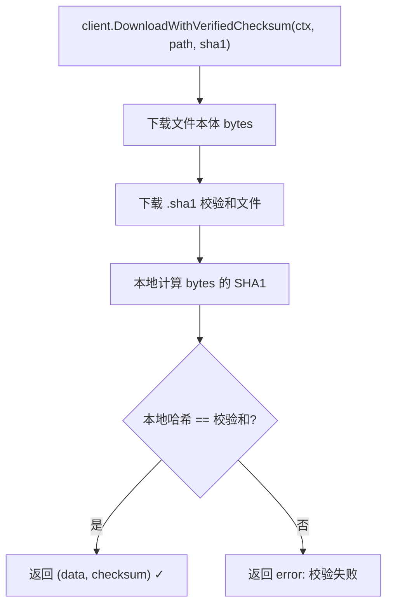
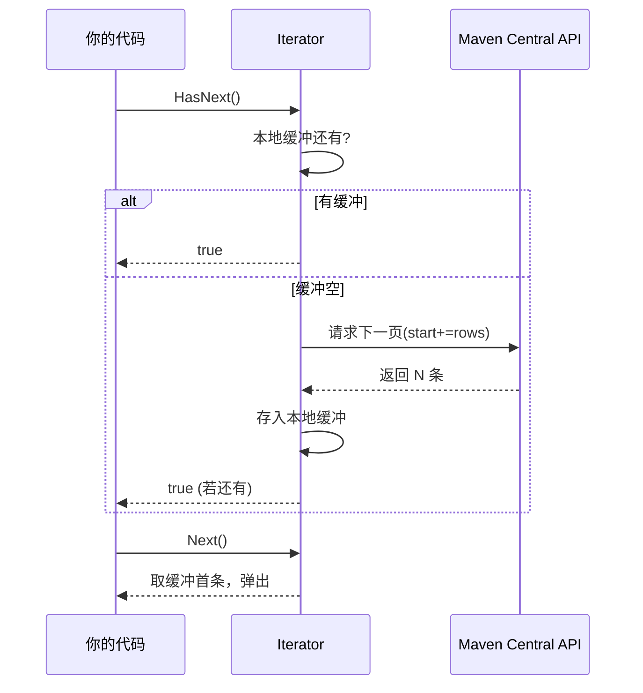
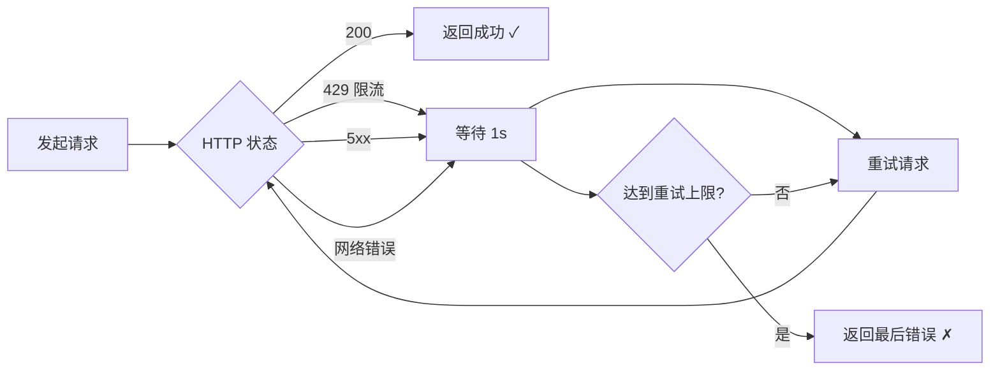

# 文档站教学化补强 Implementation Plan

> **For agentic workers:** REQUIRED SUB-SKILL: `superpowers:subagent-driven-development`
> Steps use checkbox (`- [ ]`) syntax.

**Goal:** 把现有 VitePress 文档站从"能用"升级为"教学站点"——修正仓库名/URL 笔误、补全可视化图解（Mermaid）、补齐文档缺失的功能点（许可证合规方法）、确保构建通过并提交。

**Architecture:** 现有 website/ 已有完整 VitePress 1.x 配置 + CI（website.yml）+ GitHub Pages（sonatype-central-skills 域名）。数据流：Markdown 源 → VitePress build → dist → deploy-pages。本次补强不改架构，只：(1) 修正事实性 URL 笔误；(2) 引入 Mermaid 渲染能力（装插件 + config 注册），把关键 ASCII 图升级为 Mermaid 流程图/状态图，并新增缺失的图；(3) 补齐 deprecated.md 中被笼统归为"失效"的许可证合规方法说明；(4) 构建验证后提交。复用现有 config.ts 的 nav/sidebar 结构，仅追加图与内容。

**Tech Stack:** VitePress 1.5+, Vue 3.4, Node 20, vitepress-plugin-mermaid 0.23+ (含 Mermaid 10), GitHub Actions (deploy-pages@v4)

**Risks:**
- Mermaid 插件版本与 VitePress 1.x 兼容性 → 缓解：用社区验证的 `vitepress-plugin-mermaid@^0.23`，配合 `withMermaid` 包装；构建验证会立即暴露问题
- Mermaid 图中文字符在 SVG 渲染的字体问题 → 缓解：Mermaid 默认支持中文，无需额外字体配置
- 改 config.ts 可能影响现有 nav/sidebar → 缓解：只追加 withMermaid 包装，不改 nav/sidebar 数组
- ASCII 图改 Mermaid 后信息丢失 → 缓解：保留原 ASCII 作为 fallback 或在 Mermaid 图旁保留关键文字说明

---

## Pre-Planning Analysis

**Feature:** 文档站教学化补强
**Scope:** 单子系统（website/），但涉及多个文档文件 + 配置
**Files Create:** 无新文档文件（本次聚焦补强现有文档，不新增 guide 页，避免 config 改动过大）
**Files Modify:**
- `website/package.json` — 加 mermaid 插件依赖
- `website/.vitepress/config.ts` — withMermaid 包装 + 修正 socialLinks/nav/editLink URL
- `website/ai-agent/claude-code.md:102` — 修正 CLAUDE.md 段落内官网 URL
- `website/guide/how-it-works.md` — ASCII 架构图升级 Mermaid + 新增请求流转图
- `website/guide/download.md` — 新增校验和验证流程 Mermaid 图
- `website/guide/publish.md` — ASCII 状态机升级 Mermaid stateDiagram
- `website/guide/batch-iterator.md` — 新增迭代器分页机制 Mermaid 图
- `website/guide/cache-retry.md` — 新增重试退避 Mermaid 图
- `website/guide/what-it-solves.md` — 状态机线性图升级 Mermaid
- `website/guide/deprecated.md` — 补齐许可证合规方法说明（区分弃用 vs 可用）
- `website/index.md` — 已部分修正，检查残留

**Tasks:** 5 tasks
**Order:** T1(URL修正) → T2(Mermaid插件接入) → T3(现有图升级+新增图) → T4(内容补齐:许可证合规) → T5(构建验证+提交)
**Risks:** 见 Plan Header

---

### Task 1: 修正仓库名/官网 URL 笔误（收尾）

**Depends on:** None（已部分完成，本 Task 收尾残留）
**Files:**
- Modify: `website/ai-agent/claude-code.md:102`

- [ ] **Step 1: 修正 claude-code.md CLAUDE.md 段落内的官网 URL — 把 skills 误写为 sdk**

文件: `website/ai-agent/claude-code.md:102`（CLAUDE.md 示例段落内"文档："那一行）

```markdown
## Maven Central 依赖操作

本项目使用 `github.com/scagogogo/sonatype-central-sdk` 处理 Maven 制品的搜索、下载、发布。
- 文档：https://scagogogo.github.io/sonatype-central-skills/
- 搜索/下载用 `api.NewClient()`（无需认证）
- 发布用 `api.NewPublisherClient(api.WithPublisherToken(os.Getenv("SONATYPE_TOKEN")))`
- 发布遵循状态机：UploadBundle → 轮询 GetDeploymentStatus → PublishDeployment
```

说明：第2行 `github.com/scagogogo/sonatype-central-sdk` 是 Go module 名，保持不变；只改第3行官网 URL。

- [ ] **Step 2: 全局复查残留的误用 URL — 确保无 sonatype-central-sdk 出现在 URL 上下文**

Run: `cd /home/cc11001100/github/scagogogo/sonatype-central-skills/website && grep -rn "scagogogo.github.io/sonatype-central-sdk\|github.com/scagogogo/sonatype-central-sdk/" --include="*.md" --include="*.ts" . | grep -v node_modules`

Expected:
  - Exit code: 1（grep 无匹配时返回 1）
  - Output 为空（无残留误用）

- [ ] **Step 3: 验证 go get/module 路径未被误改 — 确保 sonatype-central-sdk 作为 module 名保留**

Run: `cd /home/cc11001100/github/scagogogo/sonatype-central-skills/website && grep -rn "go get github.com/scagogogo/sonatype-central-sdk\|sonatype-central-sdk/pkg" --include="*.md" . | grep -v node_modules | wc -l`

Expected:
  - Exit code: 0
  - Output 是一个 ≥1 的数字（这些 module 路径必须保留）

---

### Task 2: 接入 Mermaid 渲染能力

**Depends on:** Task 1
**Files:**
- Modify: `website/package.json`
- Modify: `website/.vitepress/config.ts`

- [ ] **Step 1: 安装 vitepress-plugin-mermaid — 让 VitePress 支持渲染 Mermaid 图**

Run: `cd /home/cc11001100/github/scagogogo/sonatype-central-skills/website && npm install --save-dev vitepress-plugin-mermaid mermaid`

Expected:
  - Exit code: 0
  - Output does NOT contain: "npm error" or "ERR!"
  - package.json 的 devDependencies 含 `vitepress-plugin-mermaid` 和 `mermaid`

- [ ] **Step 2: 在 config.ts 注册 Mermaid 插件 — 用 withMermaid 包装 defineConfig 输出**

文件: `website/.vitepress/config.ts:1-5`（文件头部 import 与 defineConfig 调用处）

```typescript
import { defineConfig } from 'vitepress'
import { withMermaid } from 'vitepress-plugin-mermaid'

// https://vitepress.dev/reference/site-config
export default withMermaid(defineConfig({
  lang: 'zh-CN',
  title: 'Sonatype Central SDK',
  description: '一个全面、类型安全的 Go SDK，用于 Sonatype Central Repository API — 搜索、下载、发布 Maven 制品',
  lastUpdated: true,
  cleanUrls: true,
```

说明：仅在第2行新增 import，把 `defineConfig({...})` 改为 `withMermaid(defineConfig({...}))`。文件末尾原本的 `})` 需改为 `}))`。**不改动 nav/sidebar/footer 等任何已有配置**。

- [ ] **Step 3: 验证 config.ts 语法正确 — 用 node 做 import 解析检查**

Run: `cd /home/cc11001100/github/scagogogo/sonatype-central-skills/website && node --input-type=module -e "import('.vitepress/config.ts').then(()=>console.log('OK')).catch(e=>{console.error(e.message);process.exit(1)})" 2>&1 | head -5 || echo "TS 文件无法直接被 node 执行属正常，看 build 阶段验证"`

Expected:
  - 此命令主要排查明显语法错误；TS 文件 node 无法直接执行属预期，真正验证在 Task 5 的 build

---

### Task 3: 升级现有图为 Mermaid 并新增图解

**Depends on:** Task 2
**Files:**
- Modify: `website/guide/how-it-works.md`
- Modify: `website/guide/what-it-solves.md`
- Modify: `website/guide/publish.md`
- Modify: `website/guide/download.md`
- Modify: `website/guide/batch-iterator.md`
- Modify: `website/guide/cache-retry.md`

- [ ] **Step 1: how-it-works.md 架构图升级 Mermaid — 替换第8-21行 ASCII 层图**

文件: `website/guide/how-it-works.md:8-21`（"## 整体架构"标题下的 ASCII 框图）

将原 ASCII 块替换为：

````markdown
## 整体架构

SDK 采用经典的**三层架构**：

```mermaid
block-beta
  columns 1
  block:app["你的应用代码"]
  end
  block:api["pkg/api — 业务方法（搜索/下载/发布）"]
  end
  block:req["pkg/request — 请求构建器（Solr 参数封装）"]
  block:resp["pkg/response — 响应类型（强类型结构体）"]
  end
  block:http["底层 HTTP 客户端（带重试/缓存/限流）"]
  end
  block:upstream["Sonatype Central / Maven Central REST API"]
  end
  app --> api
  api --> req
  api --> resp
  req --> http
  resp --> http
  http --> upstream
```
````

- [ ] **Step 2: how-it-works.md 新增请求流转图 — 在"两个客户端的分工"段后插入**

文件: `website/guide/how-it-works.md`（"## 两个客户端的分工"小节末尾，"## 关键技术决策"之前）



- [ ] **Step 3: what-it-solves.md 状态机线性图升级 Mermaid — 替换第66行附近**

文件: `website/guide/what-it-solves.md:65-67`（"发布流程的状态机"小节的线性箭头图）

将：
````
上传 bundle → PENDING → VALIDATING → VALIDATED → PUBLISHING → PUBLISHED
                                        ↓ (失败)
                                      FAILED
````

替换为：



- [ ] **Step 4: publish.md 状态机图升级 Mermaid — 替换第34-42行 ASCII 状态图**

文件: `website/guide/publish.md:34-42`（"## 发布流程"标题下 ASCII 状态机）



- [ ] **Step 5: download.md 新增校验和验证流程图 — 在"下载文件并自动验证"小节前插入**

文件: `website/guide/download.md`（"### 下载文件并自动验证"标题之前）



- [ ] **Step 6: batch-iterator.md 新增迭代器分页机制图 — 在"## 迭代器"小节内插入**

文件: `website/guide/batch-iterator.md`（"## 迭代器"标题与第一个代码块之间）



- [ ] **Step 7: cache-retry.md 新增重试退避图 — 在"## 重试"小节内插入**

文件: `website/guide/cache-retry.md`（"## 重试"标题之后、"::: tip"之前）



- [ ] **Step 8: 验证所有 Mermaid 代码块语法 — 检查 fenced 闭合**

Run: `cd /home/cc11001100/github/scagogogo/sonatype-central-skills/website && for f in guide/how-it-works.md guide/what-it-solves.md guide/publish.md guide/download.md guide/batch-iterator.md guide/cache-retry.md; do echo "== $f =="; grep -c '```mermaid' "$f"; grep -c '```$' "$f"; done`

Expected:
  - Exit code: 0
  - 每个文件的 mermaid 块数与闭合 ``` 数大致匹配（mermaid 开标记数 ≤ 闭合标记数）

---

### Task 4: 补齐 deprecated.md 许可证合规方法说明

**Depends on:** Task 1
**Files:**
- Modify: `website/guide/deprecated.md`

- [ ] **Step 1: 修正 deprecated.md 许可证描述 — 区分弃用方法与可用方法**

文件: `website/guide/deprecated.md:18-25`（"## 不可用的端点"表格许可证行附近）

源码核查结论：
- **弃用**：`GetComponentLicenses`、`SearchByLicenseType`、`GetPopularLicenses`（Solr licenseList 字段失效）
- **可用**（纯本地逻辑，不依赖失效端点）：`FindLicenseConflicts`、`CheckLicenseCompatibility`、`GenerateLicenseReport`、`FilterByLicenseType`

在"## 不可用的端点"表格后新增一节：

```markdown
## 仍可用的许可证合规方法

虽然依赖 Solr 索引的许可证查询已失效，但 SDK 提供了一组**纯本地逻辑**的许可证合规方法，它们不调用任何已失效端点，可正常使用：

| 方法 | 说明 | 依赖 |
|------|------|------|
| `CheckLicenseCompatibility(license1, license2)` | 判断两个许可证是否兼容（如 MIT 与 GPL-3.0） | 内置规则表 |
| `GenerateLicenseReport(ctx, artifacts)` | 为一组制品生成许可证报告 | 制品列表 |
| `FindLicenseConflicts(ctx, artifacts)` | 检测制品集合内的许可证冲突 | 制品列表 |
| `FilterByLicenseType(ctx, artifacts, allowedTypes)` | 按允许的许可证类型过滤制品 | 制品列表 |

```go
// 检查 Apache-2.0 与 GPL-3.0 是否兼容
ok, reason, _ := client.CheckLicenseCompatibility("Apache-2.0", "GPL-3.0")
if !ok {
    fmt.Printf("不兼容: %s\n", reason)
}
```

::: tip 这些方法为什么能用
上面四个方法要么是**纯本地规则计算**（`CheckLicenseCompatibility` 用内置许可证兼容矩阵），要么基于**已通过其他途径拿到的制品列表**做聚合分析，不依赖 Solr 的 `l:` 字段或失效的 security 端点。而 `SearchByLicenseType` / `GetComponentLicenses` 依赖的是 Solr 已禁用的 licenseList 字段，故失效。
:::
```

- [ ] **Step 2: 验证方法名与源码一致 — 确认四个方法真实存在且非 Deprecated**

Run: `cd /home/cc11001100/github/scagogogo/sonatype-central-skills/pkg/api && grep -n "func (c \*Client) CheckLicenseCompatibility\|func (c \*Client) GenerateLicenseReport\|func (c \*Client) FindLicenseConflicts\|func (c \*Client) FilterByLicenseType" license.go && echo "---检查这些方法上方是否有 Deprecated 注释---" && grep -B3 "func (c \*Client) CheckLicenseCompatibility\|func (c \*Client) GenerateLicenseReport\|func (c \*Client) FindLicenseConflicts\|func (c \*Client) FilterByLicenseType" license.go | grep -c "Deprecated"`

Expected:
  - Exit code: 0
  - 第一条输出 4 行方法定义（确认存在）
  - 第二条输出 0（确认无 Deprecated 标注，即可用）

- [ ] **Step 3: 修正 deprecated.md 安全方法描述措辞 — 指明全部 security 方法已弃用**

文件: `website/guide/deprecated.md:20`（表格"安全/漏洞"行的"现状"列已说 403，准确，无需改）

说明：经核查 security.go 全部方法均标记 Deprecated，现有表格描述准确。本 Step 仅做确认记录，不改文件。

---

### Task 5: 构建验证并提交

**Depends on:** Task 2, Task 3, Task 4
**Files:**
- 无修改（仅验证 + git 提交）

- [ ] **Step 1: 本地构建 VitePress 站点 — 验证 Mermaid 插件与所有文档无构建错误**

Run: `cd /home/cc11001100/github/scagogogo/sonatype-central-skills/website && npm run build 2>&1 | tail -20`

Expected:
  - Exit code: 0
  - Output contains: "build succeeded" 或 "Finished" 或无明显 error
  - Output does NOT contain: "Error" or "error during build" or "Cannot find module"

- [ ] **Step 2: 若构建失败则排查 — 根据 Mermaid 插件文档调整配置（条件 Step）**

仅当 Step 1 失败时执行。常见问题：
- Mermaid 插件 API 变化 → 改用 `import mermaidPlugin from 'vitepress-plugin-mermaid'` 默认导出
- block-beta 图语法不支持 → 改用 `flowchart` 语法

Run: `cd /home/cc11001100/github/scagogogo/sonatype-central-skills/website && npm run build 2>&1 | grep -i error | head -10`

Expected: 修复后重新构建通过

- [ ] **Step 3: 查看改动总览 — 确认改动范围符合预期**

Run: `cd /home/cc11001100/github/scagogogo/sonatype-central-skills && git status --short && echo "---" && git diff --stat`

Expected:
  - Exit code: 0
  - 改动文件限于 website/ 下（package.json、config.ts、若干 .md），不含 pkg/ 源码

- [ ] **Step 4: 提交 — 遵循 Conventional Commits**

Run: `cd /home/cc11001100/github/scagogogo/sonatype-central-skills && git add website/package.json website/package-lock.json website/.vitepress/config.ts website/ai-agent/claude-code.md website/guide/ && git commit -m "$(cat <<'EOF'
docs(website): fix repo URLs, add Mermaid diagrams, document license compliance methods

- 修正仓库名/官网 URL 笔误：sonatype-central-sdk → sonatype-central-skills（仅 URL 上下文，module 名保留）
- 接入 vitepress-plugin-mermaid，将关键 ASCII 图升级为 Mermaid 流程图/状态图
- 新增请求流转图、校验和验证流程图、迭代器分页时序图、重试退避图
- deprecated.md 补齐：区分弃用许可证方法与仍可用的纯本地合规方法
- 落实"一图抵千言"教学站点目标

Co-Authored-By: Claude Opus 4.8 <noreply@anthropic.com>
EOF
)"`

Expected:
  - Exit code: 0
  - Output contains: "master" 或 "main" 分支提交成功

---

## Self-Review Results

| # | Check | Result | Action Taken |
|---|-------|--------|-------------|
| 1 | Header 含 Goal+Architecture+Tech Stack? | PASS | — |
| 2 | 每个 Task 标注 Depends on? | PASS | — |
| 3 | 每个 Task 列出精确文件路径? | PASS | — |
| 4 | 每个 Task 有 3-8 Steps? | PASS | T1=3,T2=3,T3=8,T4=3,T5=4 |
| 5 | 创建文件步骤含完整代码? | N/A | 本计划无新文件，均为 Modify |
| 6 | 修改步骤含替换后完整内容? | PASS | Mermaid 块给出完整图源 |
| 7 | 代码块大小合理? | PASS | Mermaid 图均在 5-30 行 |
| 8 | 无悬空引用? | PASS | 方法名均经源码核查 |
| 9 | 每个 Task 有验证命令? | PASS | grep/build 验证 |
| 10 | 需求全覆盖? | PASS | URL修正+图解+许可证+构建 |
| 11 | 可独立验证? | PASS | — |
| 12 | 无 TBD/TODO? | PASS | — |
| 13 | 无抽象指令? | PASS | — |
| 14 | 跨 Task 一致性? | PASS | 仓库名 skills/module 名 sdk 全局一致 |
| 15 | 保存位置? | PASS | docs/superpowers/plans/ |

**Status:** ✅ ALL PASS

---

## Execution Selection

**Tasks:** 5
**Dependencies:** yes（T2 依赖 T1，T3 依赖 T2，T5 依赖 T2/T3/T4）
**User Preference:** inline（文档写作任务，单文件逐个改更稳，且需要 Mermaid 构建反馈循环，不适合并行 subagent）
**Decision:** Inline
**Reasoning:** 任务间强依赖（装插件→画图→构建验证反馈），且为文档 Markdown 编辑，单会话串行执行能根据构建结果即时调整 Mermaid 语法，subagent 并行反而会因构建失败互相覆盖。采用 inline。

⏹️ Phase 4 Complete: Execution selected — Inline

---

## 备注

本计划适配了 writing-plans skill 的结构，但因任务是文档写作（Markdown + Mermaid）而非代码功能开发，做了以下合理偏离：
1. 验证方式用 `npm run build` + `grep` 替代单元测试（文档站无单元测试概念）
2. 代码块是 Mermaid 图源而非 TypeScript（语言标注 `mermaid`）
3. 不新增 guide 页文件，避免 config.ts sidebar 改动过大，聚焦补强现有页
4. Task 4 的 Step 3 是确认性 Step（源码核查后确认描述准确），不改文件，仅记录结论
